# Multi-UAV-Search-SAGIN-HybridDRLGA
Multi-UAV cooperative search with SAGIN and Hybrid DRL/GA. 

# Overview

It is recommended to run this work using Python 3.12.5 to ensure compatibility and reproducibility.

# Requirements

The requirements are listed in the requirements.txt file. You can install them using pip:

# File Description

## map

**map** folder is a random terrain generator used in our paper, capable of generating various terrains randomly.

## preliminary_experiment

The folder **preliminary_experiment** contains the preliminary experiments conducted for this paper.

### Reproduce_experiments_from_other_papers 

Experiments reproduced from other published papers are organized in the **Reproduce_experiments_from_other_papers** folder.

The data used in our experiments were generated from the provided **_.ipynb_** notebooks. We have also preserved the corresponding experimental results. 
In particular, the **_Comparison.ipynb_** notebook summarizes the experimental outcomes and presents them in tabular form for clear comparison.

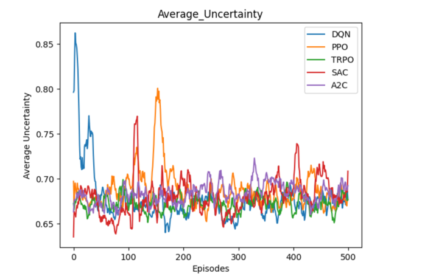

The **improved_experiment** folder contains our optimized versions of the experiments.

This part of the experimental data was also generated from the corresponding **_.ipynb_** notebooks. 
We have retained all experimental results for reproducibility. The results have been organized and 
presented in tabular form in the **_Comparison.ipynb_** notebook for clear and structured comparison.

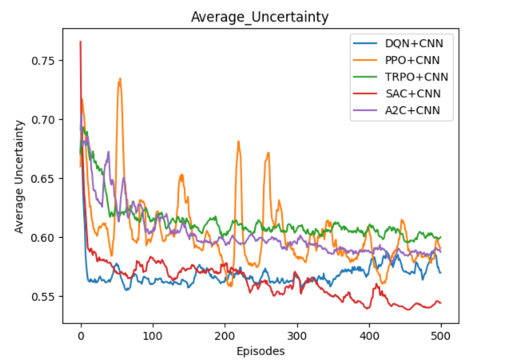

## our_experiment

The **our_experiment** directory contains the experimental data and environment specifically designed for this study

The HCSAC directory contains environment modeling and algorithm optimization tailored to more realistic scenarios designed by us.

Please note that, for confidentiality, the environment and algorithm are currently encrypted and will be disclosed after the paper is accepted for publication

The encrypted content is located in the **HCSAC/ENV** directory, and it has been designed to be compatible with Windows and macOS platforms.

We have placed both the experimental data and the pre-trained models in the **HCSAC/data** directory.

We conducted a comparison of various deep reinforcement learning algorithms trained using our hybrid convolution method. The experimental setup is illustrated in the following diagram.

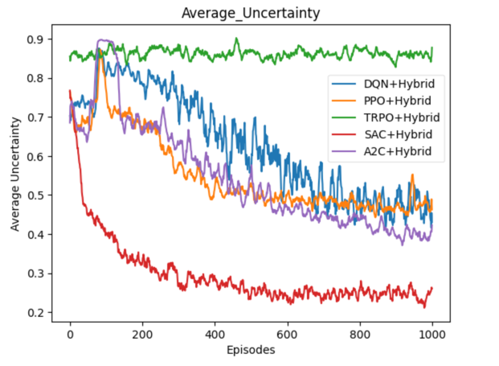

### HCSAC


The model integration has been completed. To begin, please start by running the initial set of experiments.

```bash
cd our_experiment/HCSAC
python vis_offloading.py
python vis_without_offloading.py
```

The execution of the code results in the generation of two trajectory plots, as shown below.

| Without Offloading | Offloading |
|--------------------|------------|
|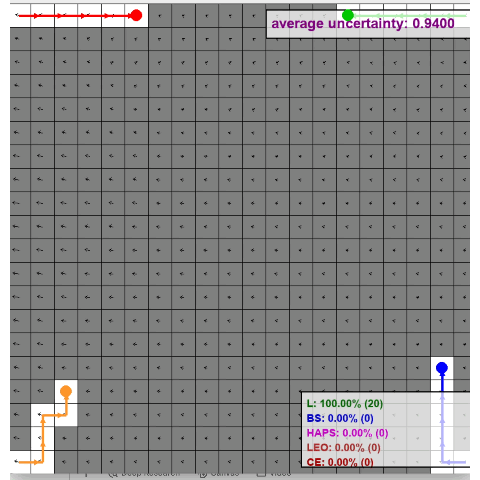|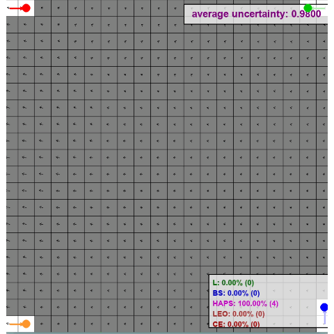|


Following this, we tested how the algorithm performs in terms of uncertainty when varying the number of UAVs in the scenario.

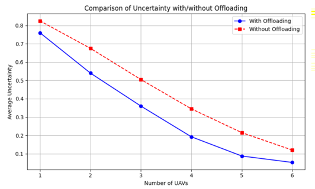

We applied a hybrid convolutional approach to optimize both UAV trajectory planning and task offloading within the environment. 
The figure below demonstrates that our discretized SAC algorithm is well-suited for supporting both flight control and offloading decision-making for UAVs.

| CNN | GCN |
|-----|-----|
|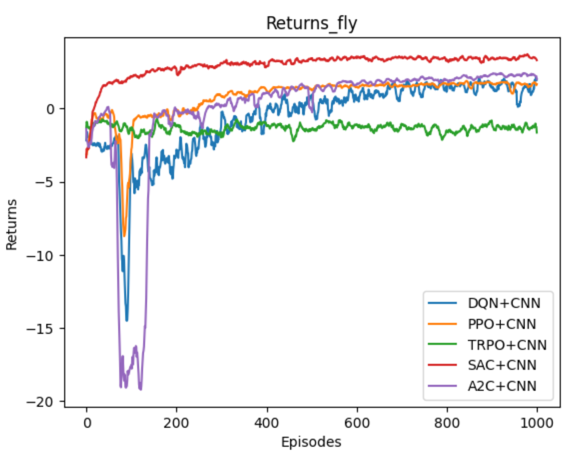|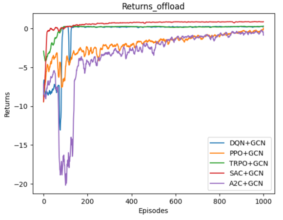|

### GA

Subsequently, we performed a GA-based optimization experiment to determine the optimal deployment locations. 
The algorithm was iterated 30 times using 50 randomly initialized samples. As a result, we identified the best-performing population, 
the optimal deployment configuration, and the corresponding optimal trajectories.

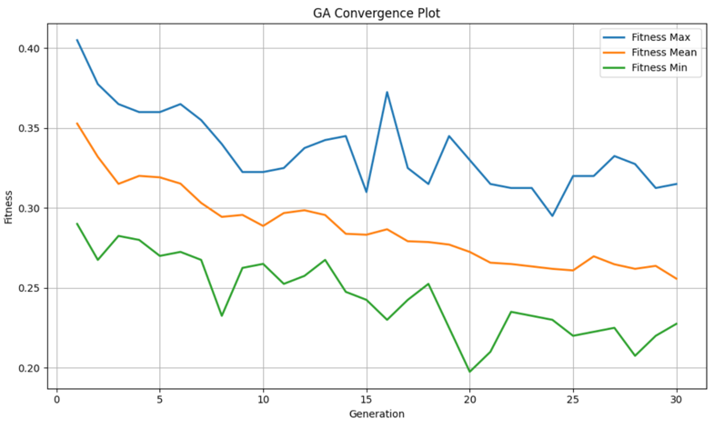

In the final step, we performed trajectory execution and generated UAV trajectory plots, comparing the results before and after applying the GA-based optimization.

```bash
cd our_experiment/GA
python GA_Optimal_population_testing_0.py
python vis_without_Optimal_population_testing_0.py
```

| Without GA | Usa Optimal GA                            |
|------------|-------------------------------------------|
|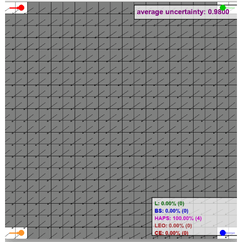| 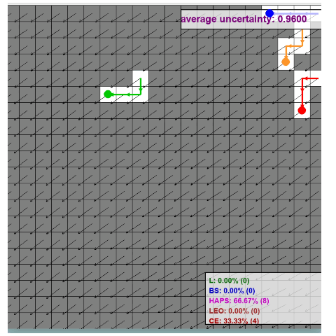 |


If you need the source code, please contact me via email.