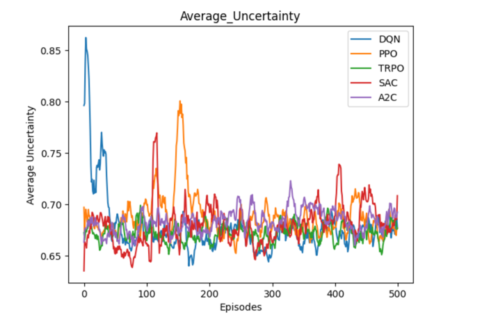

# Multi-UAV-Search-SAGIN-HybridDRLGA
Multi-UAV cooperative search with SAGIN and Hybrid DRL/GA. 

# Overview

It is recommended to run this work using Python 3.12.5 to ensure compatibility and reproducibility.

# Requirements

The requirements are listed in the requirements.txt file. You can install them using pip:

# File Description

## map

**map** folder is a random terrain generator used in our paper, capable of generating various terrains randomly.

## preliminary_experiment

The folder **preliminary_experiment** contains the preliminary experiments conducted for this paper.

### Reproduce_experiments_from_other_papers 

Experiments reproduced from other published papers are organized in the **Reproduce_experiments_from_other_papers** folder.

The data used in our experiments were generated from the provided **_.ipynb_** notebooks. We have also preserved the corresponding experimental results. 
In particular, the **_Comparison.ipynb_** notebook summarizes the experimental outcomes and presents them in tabular form for clear comparison.

The **improved_experiment** folder contains our optimized versions of the experiments.

## our_experiment

The **our_experiment** directory contains the experimental data and environment specifically designed for this study

The HCSAC directory contains environment modeling and algorithm optimization tailored to more realistic scenarios designed by us.

Please note that, for confidentiality, the environment and algorithm are currently encrypted and will be disclosed after the paper is accepted for publication

The encrypted content is located in the **HCSAC/ENV** directory, and it has been designed to be compatible with Windows and macOS platforms.

# detail

